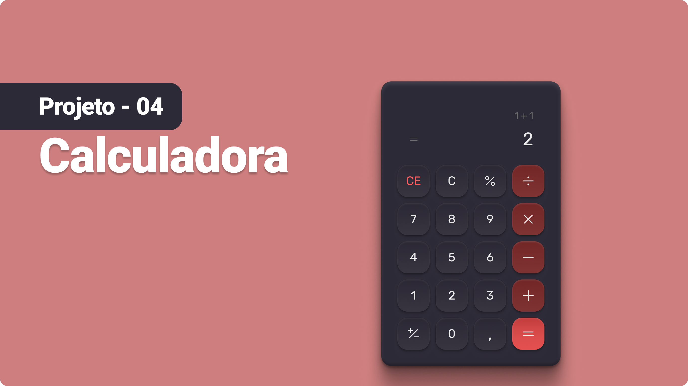

<h1 align="center"> Calculadora </h1>

#boraCodar são desafios semanais, promovido pela Rocketseat para ensino de tecnologias WEB.  

  <a href="#-tecnologias">Tecnologias</a>&nbsp;&nbsp;&nbsp;|&nbsp;&nbsp;&nbsp;
  <a href="#-layout">Layout</a>&nbsp;&nbsp;&nbsp;|&nbsp;&nbsp;&nbsp;
  <a href="#memo-direitos-autorais">Direitos Autorais</a>

 

  

## 🚀 Tecnologias

Esse projeto foi desenvolvido com as seguintes tecnologias:

- HTML e CSS
- Git e Github
- Figma

## 🔖 Layout

Você pode visualizar o layout do projeto através [DESSE LINK](https://www.figma.com/file/JkJzlMrZ9sIm7JZZgwwp7L/Calculadora?type=design&node-id=442%3A3&mode=design&t=88EetjMC9w1KtR2y-1). É necessário ter conta no [Figma](https://figma.com) para acessá-lo.

## :direitos-autorais: Direitos Autorais

Esse projeto foi feito por Luan Oliveira dos Santos para estudo Educacional

---

Espero que tenha lhe ajudado
